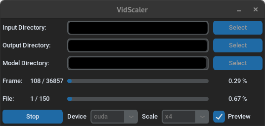

# video-upscaler

[](https://github.com/nbdy/vidscaler)

upscale (x2/x4/x8) a video or a directory of videos using the command line

## dependencies
- moviepy
- loguru
- opencv
- torch
- numpy
- tqdm
- [Real-ESRGAN](https://github.com/sberbank-ai/Real-ESRGAN)


## how to ..

### .. install

```shell
# from pypi
pip install vidscaler

# from git repo
pip install git+https://github.com/nbdy/vidscaler
```

### .. run

#### .. gui



```shell
vidscaler-gui
# or
vidscaler --gui
```

#### cli

```shell
vidscaler --help
usage: vidscaler [-h] -i INPUT -o OUTPUT [-c] [-s SCALE]
                   [-m MODEL_DIRECTORY] [-g] [-p]

options:
  -h, --help            show this help message and exit
  -i INPUT, --input INPUT
                        Input directory or file
  -o OUTPUT, --output OUTPUT
                        Output directory or file
  -c, --cpu             Use CPU mode
  -s SCALE, --scale SCALE
                        Upscaling factor
  -m MODEL_DIRECTORY, --model-directory MODEL_DIRECTORY
  -g, --gui             Run the GUI
  -p, --preview         Enable live preview
```

## todo

- [ ] pausing
- [ ] start from last stopped point
  - json {"path": "path to video file", "frame": frame} as checkpoint.json?
- [ ] total runtime estimation
  - get total frame count of all videos 
  - avg. each frame processing duration
  - avgT * frameN = duration
- [ ] confirmation box when exiting/stopping while upscaling is running